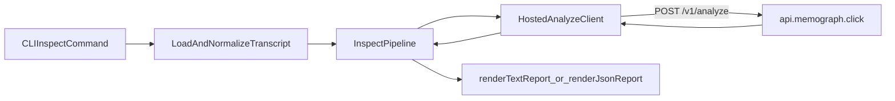

# CLI Hosted Analyze Implementation

## Goal

Move analysis execution from local/provider-specific LLM calls to a hosted API at `https://api.memograph.click/v1/analyze` (with optional `/analyze` alias), so users can run `memograph` without configuring providers, models, or login.

## Scope

- In scope: CLI and interactive UX changes, config model changes, hosted HTTP client integration, migration strategy, and error behavior.
- Out of scope: implementing backend API service.

## Current-State Touchpoints (What Exists Today)

These code paths are currently tightly coupled to provider-based LLM setup:

- `src/cli.ts`
  - `inspect` command exposes `--llm-provider`, `--llm-model`, `--llm-api-key`, `--llm-base-url`, `--llm-temperature`, `--llm-max-tokens`.
  - Passes `config.llm` into `inspectTranscript(...)`.
- `src/interactive/index.ts`
  - Blocks inspect flow when LLM setup is incomplete (`checkAndPromptWizard` + `isLLMConfigured`).
  - Settings menu is centered around provider/model/key management.
- `src/interactive/wizard.ts`
  - LLM provider/category chooser and API-key prompts.
- `src/interactive/settings.ts`
  - `defaultSettings.llm` schema.
  - `isLLMConfigured` enforces provider/model and key requirement.
- `src/core/inspect.ts`
  - Instantiates `createLLMClient(...)`.
  - Calls extraction/detection LLM pipeline directly.
- `src/core/llm/client.ts`
  - Provider-specific client construction and completion methods.

## Target Architecture

## Implementation Plan

### 1) Introduce Hosted Analyze Mode

Add a hosted analyze integration path that becomes the default:

- New module: `src/core/hosted/analyze-client.ts`
  - `analyzeTranscript(payload, options): Promise<InspectResult>`
  - Uses native `fetch` (Node 18+) or existing runtime polyfill.
  - Endpoint default: `https://api.memograph.click/v1/analyze` (allow `/analyze` alias during migration).
  - Configurable request timeout and bounded retries.
- New module: `src/core/hosted/types.ts` (optional)
  - Explicit request/response interfaces for hosted transport.

### 2) Keep `InspectResult` Stable

Avoid renderer churn by mapping API response directly to existing `InspectResult` (`src/core/types.ts`):

- Required output keys:
  - `drift_score`
  - `raw_score`
  - `token_waste_pct`
  - `events`
  - `should_have_been_memory`
  - `timings_ms`
- Validation:
  - Validate shape at boundary; fail with clear error if malformed.

### 3) Refactor Core Inspection Entry

Refactor `src/core/inspect.ts`:

- Replace direct `LLMClient` execution path with hosted request path.
- Preserve transcript handling behavior:
  - JSON message transcripts.
  - `raw_text` transcripts.
  - `max_messages` capping.
- Optional temporary compatibility:
  - Gate old logic behind `MEMOGRAPH_ANALYZE_MODE=llm`.
  - Default path `MEMOGRAPH_ANALYZE_MODE=hosted`.

### 4) CLI Command Surface Changes

Update `src/cli.ts`:

- Remove or soft-deprecate LLM-specific options:
  - `--llm-provider`
  - `--llm-model`
  - `--llm-api-key`
  - `--llm-base-url`
  - `--llm-temperature`
  - `--llm-max-tokens`
- Add hosted/API options:
  - `--api-url <url>` (default hosted URL)
  - `--api-timeout-ms <n>` (default e.g. `30000`)
  - `--api-retries <n>` (default e.g. `1`)
- Keep `--json` and existing input/output semantics unchanged.

### 5) Interactive Mode Simplification

Update `src/interactive/index.ts` and `src/interactive/settings.ts`:

- Replace “LLM configured?” gating with “API mode ready?” checks.
- Remove setup wizard dependency for standard hosted mode.
- Simplify settings schema from provider-centric to API-centric:
  - `api.url`
  - `api.timeoutMs`
  - `api.retries`
  - `api.telemetryOptIn` (optional)
- Ensure old config files still load safely (backward-compatible merge).

### 6) Wizard and Provider Registry Decommission Strategy

- Phase 1: Keep `wizard.ts`, `providers.ts`, and `llm/client.ts` only for fallback mode.
- Phase 2: Mark legacy path deprecated in docs and help output.
- Phase 3: Remove unused legacy files once hosted mode is proven stable.

## Error Handling Matrix

| Condition | CLI behavior | Exit code | Retry? |
|---|---|---:|---|
| Network timeout | `Error: Analyze API timed out. Try again.` | 1 | Optional automatic (bounded) |
| DNS/TLS/connectivity | `Error: Cannot reach analyze API.` | 1 | Optional automatic (bounded) |
| `400` invalid transcript | `Error: Transcript format invalid.` | 1 | No |
| `413` payload too large | `Error: Transcript too large. Reduce input size.` | 1 | No |
| `429` rate limit | `Error: Rate limit reached. Retry later.` | 1 | Yes (respect `Retry-After`) |
| `5xx` server error | `Error: Analyze service unavailable.` | 1 | Yes (small bounded retries) |
| Malformed response body | `Error: Invalid API response.` | 1 | No |

## Rollout Plan

### Phase 1: Dual-Path (Safe Migration)

- Introduce `MEMOGRAPH_ANALYZE_MODE=hosted|llm`.
- Default remains configurable during testing windows.
- Collect stability metrics from CLI failures (non-sensitive only).

### Phase 2: Hosted Default

- Default to hosted mode across CLI + interactive.
- Keep legacy mode behind explicit env var only.

### Phase 3: Legacy Retirement

- Remove provider-specific wizard and flags.
- Remove obsolete LLM config validation paths.
- Clean up docs and examples to hosted-only flow.

## Testing Plan

- Unit tests
  - Hosted client request construction and timeout behavior.
  - Error mapping from HTTP/network failures to user-facing errors.
  - Response-shape validation and `InspectResult` mapping.
- Integration tests
  - `memograph inspect -i <file>` with mocked API success/failure.
  - `--json` output compatibility with current parsers.
- Manual checks
  - Interactive flow no longer requires provider key setup.
  - Existing transcripts produce expected report format.

## User-Facing Documentation Updates

- Update `README.md`:
  - Remove provider setup emphasis.
  - Add “Hosted analysis by default” behavior.
- Update `INTERACTIVE.md`:
  - Replace provider wizard steps with API mode settings.
  - Keep transcript input/output workflow unchanged.

## Backward Compatibility Notes

- Existing `~/.memograph/config.json` with `llm.*` should not crash parsing.
- Prefer soft migration:
  - Ignore legacy `llm` fields when hosted mode is active.
  - Emit one-time informational notice about deprecated fields.
